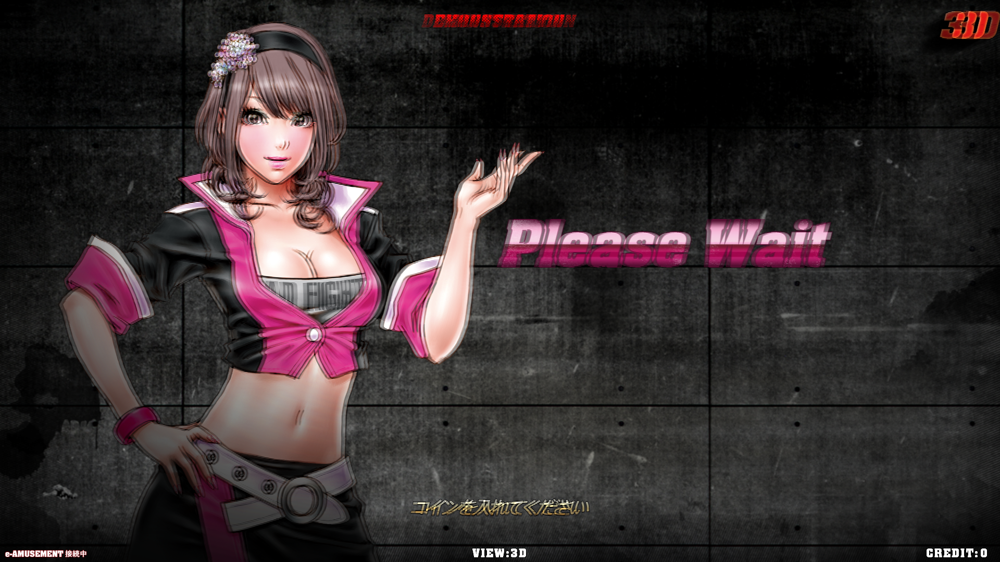
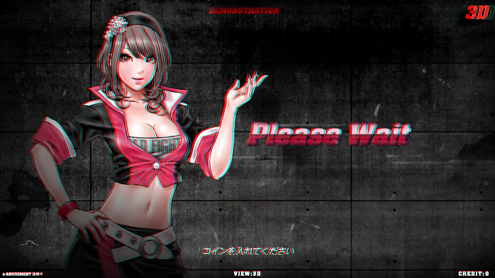

# road-fighters-3d-shader
a simple ReShade shader to convert interlaced 3d to a format compatible with any display. Made to work with Konami's Road Fighters 3D arcade data, for those of us who have gotten our hands on the hardware but lack the 3d screen of the original cabinet. 

Before:

After:

Installation:
- visit reshade.me and grab reshade
- run the reshade installer on the game executable
- copy shader.fx into the proper directory
- turn it on and put on your 3d glasses!
